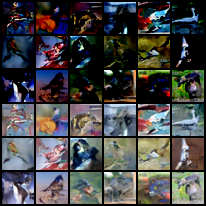

# Denoising Diffusion Probabilistic Model

Done as part of ADL course work

# Code

## main.py

1. Attention-Unet model - Creates Unet model for Reverse Diffusion - Unet retrieved denoised images or alteratnely the added noise to the noisy image. The predicted noise is substracted from the noise to generate the new image
2. Diffusion - Diffusion model
3. train method - calls diffusor.p_loss method
   Does forward diffusion (takes good image - return noisy image) - q_sample
   Does backward diffusion using Unet model(takes noise- return predicted noise) - q_sample
4. Compare the noises and its difference is the loss

## diffusion.py

1. Defines several noise scheduler - to be added during forward diffusion process
2. sample - method generating new images given noise
3. p_sample - Reverse Diffusion - single step in time point t
4. q_sample - generate a noisy sample xt from a sample x0 at a timepoint t

For Class Conditioning - Added classifier free guidance
Means instead of having classifier as a downstream task, the generation process is consitioned on class labels so we can generate image in each classes

Sample Images Generated

